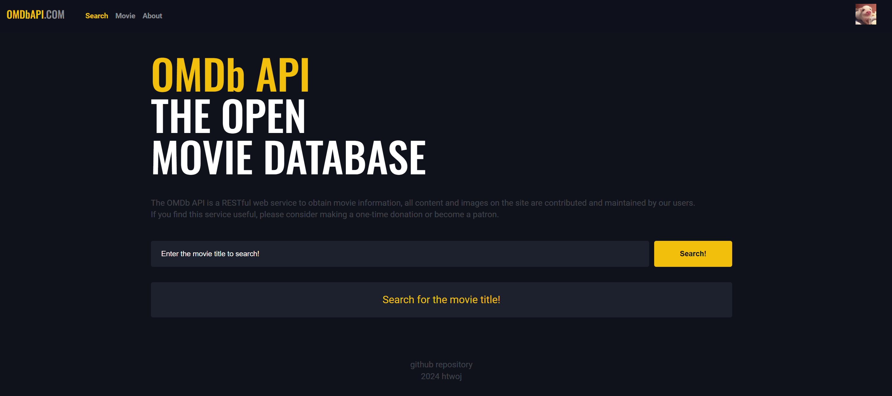

# 예제 4 - 영화 검색 사이트 - JS

## 설명
- HTML/CSS/JS를 활용하여 영화 검색 사이트 구현
- OMDB API 사용
- <a href="https://movie-app-ivory-six.vercel.app/#/" target = "_blank">DEMO 페이지로 이동</a>


## 주요 파일/폴더
대문자 파일 : 모듈

**index.html**  
**src**
- main.css
- main.js // app.js 사용으로 화면에 내용 출력
- App.js  
**components**
- Headline.js // 헤드라인 텍스트
- MovieItem.js // 영화 정보(제목, 연도)
- MovieList.js // 영화 리스트
- MovieListMore.js // 검색 결과 더보기
- Search.js // 검색 이벤트
- TheFooter.js // Footer
- TheHeader.js // Header  
**core**
- core.js // component, router, store  
**routes**
- About.js // about 페이지
- Home.js // 메인 페이지
- index.js // app.js에서 생성한 routerview 요소가 생겨야, index.js에서 페이지를 구분해주도록 동작하고(페이지 주소에 맞게 컴포넌트 실행), main.js에서 router() 실행
- Movie.js // 영화 상세정보 페이지
- NotFound.js // notFound 페이지  
**store**
- movie.js // omdb api 정보
- about.js // about 페이지에 필요한 정보

## 기타
**[CSS 변수]**  
```
--color-black:#0E111B;  
--color-white: #FFF;  
--color-white-50: rgba(255,255,255,.5);  
--color-white-30: rgba(255,255,255,.3);  
--color-white-20: rgba(255,255,255,.2);  
--color-white-30: rgba(255,255,255,.1);  
--color-white-5: rgba(255,255,255,.05);  
--color-primary: #FDC000;  
--color-hover: #F86A05;  
--color-area: #1C212E;  
```

**[실시간 이미지 리사이징]**
- 요청된 이미지의 주소 정보에 맞게 서버에서 실시간으로 원본 이미지의 크기를 변경해서 응답하는 방법

**[skeleton UI]**
- 어떤 내용이 채워지기 직전까지 동작하는 애니메이션 구조

**[Serverless Functions]**
- 개발자가 서버를 직접 관리할 필요가 없는 아키텍처로 요청이 들어오면 그 때 자원을 할당해서 요청을 처리하고 다시 자원을 할당하지 않는 대기 상태로 변경
- apikey 노출 확인 및 조치 (검색 후, 개발자모드의 network - payload 시, api 키 확인 가능됨)
- package.json 수정 : "type":"module" 추가

**[환경변수]**
- 프로젝트가 동작하는 환경 자체에 특정 변수를 생성해서 데이터를 담아놓고, 그 환경에서만 데이터를 활용할 수 있는 방법
- dotenv 확장 프로그램 (.env파일 하이라이팅)
- .env 파일은 apikey를 포함하여 버전관리를 하지 않기 때문에 .gitignore에 포함
- 환경변수 내용이 많다면 매번 파일을 따로 관리해줘야함
- VERCEL - ENVIRONMENT VARIABLES 메뉴에 APIKEY 값 추가 필요